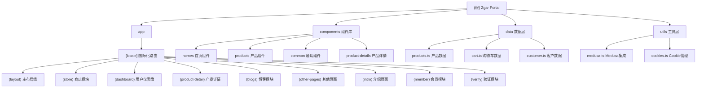

# Zgar Portal 项目架构文档

## 项目愿景
Zgar Portal 是一个基于 Next.js 16 + React 19 的现代化电商门户网站，专注于电子烟产品销售。项目支持多语言（中文简体、繁体、英文），集成了 Medusajs 作为后端电商系统，提供完整的在线购物体验，包括产品展示、购物车、用户账户管理、订单处理等核心电商功能。

## 架构总览

### 技术栈
- **前端框架**: Next.js 16 (App Router)
- **UI 框架**: React 19
- **样式方案**: Tailwindcss v4 + SCSS + Bootstrap 5
- **动画库**: GSAP、Framer Motion
- **国际化**: next-intl
- **状态管理**: React Query (TanStack Query)
- **后端集成**: Medusajs SDK
- **开发语言**: TypeScript

### 项目结构
```
zgar-portal/
├── app/                    # Next.js App Router 页面
│   └── [locale]/          # 国际化路由
│       ├── layout.tsx     # 根布局
│       └── (layout)/      # 路由组
├── components/            # React 组件库
├── data/                 # 数据获取和 API 集成
├── hooks/                # 自定义 React Hooks
├── lib/                  # 工具库
├── public/               # 静态资源
├── utils/                # 工具函数
└── widgets/              # 页面级组件
```

## 模块结构图



## 模块索引

| 模块路径 | 职责描述 | 核心文件 | 技术特点 |
|---------|---------|---------|---------|
| `app/[locale]/(layout)` | 主布局和全局组件 | layout.tsx | 国际化支持、全局状态管理 |
| `app/[locale]/(layout)/(store)` | 商店主页和产品列表 | shop/page.tsx, products/[slug]/page.tsx | 产品展示、筛选、分页 |
| `app/[locale]/(layout)/(dashboard)` | 用户中心 | layout.tsx, account-*/page.tsx | 认证、订单管理、个人信息 |
| `app/[locale]/(layout)/(product-detail)` | 产品详情页 | product-*/[id]/page.jsx | 多种产品展示布局 |
| `components/homes` | 首页组件 | 各类 Home*.jsx | 多种行业主题首页 |
| `components/products` | 产品相关组件 | ProductCards, Sorting等 | 产品展示、筛选、对比 |
| `data/` | 数据获取层 | products.ts, cart.ts | Medusajs API集成 |
| `hooks/` | 自定义Hooks | use*, GSAP相关 | 动画、交互、状态管理 |

## 运行与开发

### 开发环境
```bash
# 安装依赖
pnpm install

# 启动开发服务器
pnpm dev          # 标准模式
pnpm dev:proxy    # 代理模式（用于API开发）

# 类型检查
pnpm build        # 生产构建
```

### 环境变量
项目支持通过 `.env` 文件配置环境变量，主要配置项包括：
- Medusajs 后端 URL
- API 密钥
- 国际化配置

## 测试策略

- **组件测试**: 建议使用 React Testing Library
- **E2E 测试**: 建议使用 Playwright
- **API 测试**: Medusajs 集成测试
- **性能测试**: Next.js 内置性能分析

## 编码规范

- **TypeScript**: 严格模式，完整类型定义
- **组件命名**: PascalCase，语义化命名
- **文件组织**: 按功能模块分组，index.ts 导出
- **样式优先**: Tailwind CSS > SCSS > Inline Styles
- **代码质量**: ESLint + Prettier

## AI 使用指引

1. **开发新功能**: 先查看对应模块的 CLAUDE.md 了解现有架构
2. **组件开发**: 优先复用 components 中的现有组件
3. **数据获取**: 统一使用 data/ 层的方法，保持 API 调用一致性
4. **样式实现**: 优先使用 Tailwind CSS 类，复杂动画使用 GSAP
5. **国际化**: 所有用户可见文本需要通过 next-intl 处理

## 变更记录 (Changelog)

### 2025-12-18 10:52:29
- 初始化项目架构文档
- 创建模块结构图和导航
- 识别 8 个核心功能模块
- 完成 80% 的项目覆盖率扫描

### 待补充项
- [ ] API 接口文档需要完善
- [ ] 各模块的详细接口定义待补充
- [ ] 测试用例覆盖率需要提升
- [ ] 部署配置文档需要完善