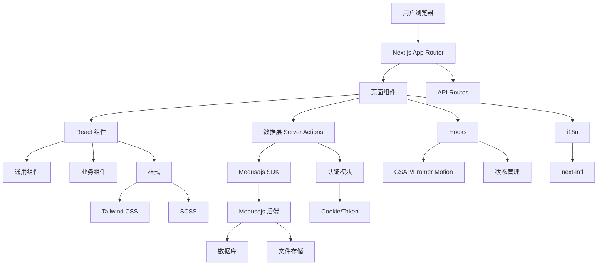
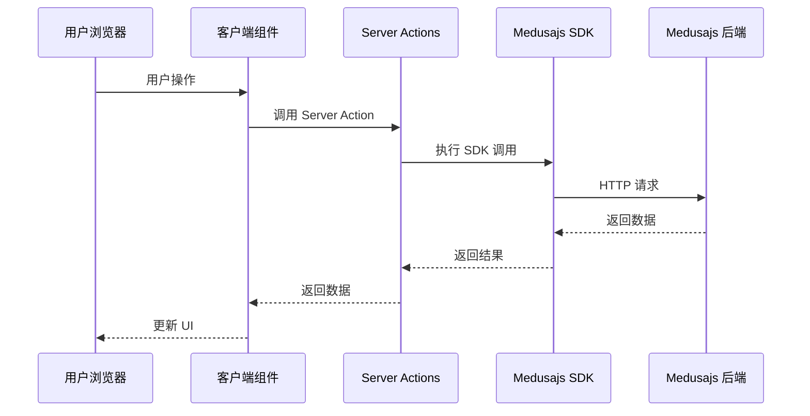
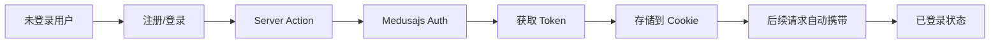

# Zgar Portal 总体架构文档 (US-018)

## 概述

Zgar Portal 是一个基于 Next.js 16 + React 19 的现代化电商门户网站，专注于电子烟产品销售。项目支持多语言（中文简体、繁体、英文），集成了 Medusajs 作为后端电商系统。

## 技术栈

### 前端框架
- **Next.js 16** - App Router 架构
- **React 19** - UI 框架
- **TypeScript** - 类型安全

### 样式方案
- **Tailwindcss v4** - 原子化 CSS
- **SCSS** - 模块化样式
- **Bootstrap 5** - 响应式组件

### 动画库
- **GSAP** - 高级动画
- **Framer Motion** - 声明式动画

### 国际化
- **next-intl** - i18n 解决方案

### 数据获取
- **RSC 模式** - Server Component 获取数据，Client Component 展示
- **Server Actions** - 服务端数据操作

### 后端集成
- **Medusajs SDK** - 电商后端 API
- **Server Actions** - 服务端数据操作

## 项目目录结构

```
zgar-portal/
├── app/                          # Next.js App Router
│   └── [locale]/                 # 国际化路由
│       ├── layout.tsx            # 根布局
│       └── (layout)/             # 路由组
│           ├── (store)/          # 商店模块
│           ├── (dashboard)/      # 用户仪表盘
│           ├── (product-detail)/ # 产品详情（27种布局）
│           ├── (blogs)/          # 博客模块
│           ├── (other-pages)/    # 其他页面
│           ├── (intro)/          # 介绍页面
│           ├── (member)/         # 会员模块
│           └── (verify)/         # 验证模块
│
├── components/                   # React 组件库
│   ├── homes/                    # 首页组件
│   ├── products/                 # 产品组件
│   ├── common/                   # 通用组件
│   ├── product-details/          # 产品详情组件
│   └── ...                       # 其他组件
│
├── data/                         # 数据层（Server Actions）
│   ├── products/                 # 产品数据
│   ├── cart/                     # 购物车数据
│   ├── orders/                   # 订单数据
│   ├── customer/                 # 客户数据
│   ├── auth/                     # 认证数据
│   ├── payments/                 # 支付数据
│   ├── anti-counterfeit/         # 防伪验证数据
│   └── ...                       # 其他数据模块
│
├── hooks/                        # 自定义 React Hooks
│   ├── useGsapAnimation.ts       # GSAP 动画 Hook
│   ├── useCustomer.ts            # 客户 Hook
│   ├── useStickyHeader.ts        # 粘性头部 Hook
│   └── ...                       # 其他 Hooks
│
├── lib/                          # 工具库
│   └── ...
│
├── utils/                        # 工具函数
│   ├── medusa.ts                 # Medusa SDK 配置
│   ├── medusa-server.ts          # 服务端 Medusa 工具
│   ├── cookies.ts                # Cookie 管理
│   └── ...                       # 其他工具
│
├── widgets/                      # 页面级组件
│   └── ...
│
├── public/                       # 静态资源
│   └── ...
│
├── docs/                         # 项目文档
│   └── architecture/             # 架构文档
│       ├── README.md             # 总体架构（本文档）
│       ├── modules/              # 模块文档
│       ├── data-layer/           # 数据层文档
│       └── design-system/        # 设计系统文档
│
└── locale/                       # 国际化翻译文件
    ├── zh/                       # 中文简体
    ├── zh-Hant/                  # 中文繁体
    └── en/                       # 英文
```

## 核心模块依赖图



## 路由结构

### 国际化路由

所有路由都通过 `[locale]` 参数支持多语言：

```
/[locale]/[page]
```

示例：
- `/zh/shop` - 中文简体商店页
- `/zh-Hant/shop` - 中文繁体商店页
- `/en/shop` - 英文商店页

### 路由组

路由组用于组织页面，不影响 URL 结构：

| 路由组 | 用途 | URL 示例 |
|--------|------|----------|
| `(store)` | 商店页面 | `/zh/shop`, `/zh/products/[id]` |
| `(dashboard)` | 用户中心 | `/zh/account`, `/zh/orders` |
| `(product-detail)` | 产品详情 | `/zh/product-video/[id]` |
| `(blogs)` | 博客 | `/zh/blog`, `/zh/blog/[slug]` |
| `(verify)` | 验证 | `/zh/verify` |
| `(member)` | 会员 | `/zh/member` |

## 数据流架构



### Server Actions 模式

所有数据操作通过 Server Actions 在服务端执行：

```typescript
// data/cart/server.ts
"use server";

export async function addToCart(item: StoreAddCartLineItem) {
  // 1. 获取认证信息
  const authHeaders = await getAuthHeaders();

  // 2. 调用 Medusajs API
  const result = await medusaSDK.client.fetch('/store/carts', {
    method: 'POST',
    headers: getMedusaHeaders(locale, authHeaders),
    body: item,
  });

  // 3. 更新缓存
  updateTag(await getCacheTag('carts'));

  return result;
}
```

## 认证流程



### Token 管理

- 存储位置：`localStorage` + `httpOnly` Cookie
- Token 类型：JWT
- 过期时间：7天

## 缓存策略

### Next.js 缓存标签

```typescript
// 获取缓存标签
const cartCacheTag = await getCacheTag('carts');

// 使用缓存标签
fetch(url, {
  next: {
    tags: [cartCacheTag],
    revalidate: 300,
  },
});

// 清除缓存
updateTag(cartCacheTag);           // 立即重新获取
revalidateTag(cartCacheTag);        // 下次访问时重新获取
```

### 缓存标签类别

| 标签 | 用途 |
|------|------|
| `carts` | 购物车数据 |
| `products` | 产品数据 |
| `customers` | 客户数据 |
| `orders` | 订单数据 |
| `regions` | 地区数据 |

## 设计系统

### 品牌色彩

- **粉色**: `#f496d3` - 温暖、活力
- **蓝色**: `#0047c7` - 专业、可靠
- **渐变**: 粉蓝渐变

详见：[品牌色彩文档](./design-system/colors.md)

### 动画系统

- **GSAP** - 高级交互动画
- **Framer Motion** - 声明式动画
- **Tailwind 动画** - 简单过渡效果

详见：[动画系统文档](./design-system/animations.md)

## 多语言支持

### 支持的语言

- 中文简体 (`zh`)
- 中文繁体 (`zh-Hant`)
- 英文 (`en`)

### 翻译文件结构

```
locale/
├── zh/
│   └── common.json
├── zh-Hant/
│   └── common.json
└── en/
    └── common.json
```

### 使用方式

```typescript
import { useTranslations } from 'next-intl';

export function MyComponent() {
  const t = useTranslations('common');
  return <h1>{t('welcome')}</h1>;
}
```

## API 集成

### Medusajs 端点

项目使用标准 Medusajs Store API + 自定义 ZGAR 端点：

| 端点 | 用途 |
|------|------|
| `/store/products` | 产品列表 |
| `/store/products/:id` | 产品详情 |
| `/store/carts` | 购物车 |
| `/store/customers/me` | 客户信息 |
| `/store/orders` | 订单列表 |
| `/store/zgar/*` | ZGAR 自定义端点 |

详见：[Medusajs 集成文档](./data-layer/medusa-integration.md)

## 开发工作流

### 本地开发

```bash
# 安装依赖
pnpm install

# 启动开发服务器
pnpm dev

# 类型检查
pnpm build
```

### 环境变量

```env
# Medusajs 后端
MEDUSA_BACKEND_URL=http://localhost:9000
MEDUSA_PUBLISHABLE_KEY=pk_xxx

# 应用配置
NEXT_PUBLIC_SITE_URL=http://localhost:3000
```

## 文档导航

### 模块文档
- [产品详情模块](./modules/product-detail.md) - 27种产品布局
- [验证模块](./modules/verify.md) - 防伪验证流程

### 数据层文档
- [数据模块 API](./data-layer/data-modules.md) - 所有数据层 API
- [Medusajs 集成](./data-layer/medusa-integration.md) - SDK 使用指南

### 设计系统文档
- [品牌色彩](./design-system/colors.md) - 色彩系统
- [动画系统](./design-system/animations.md) - 动画库使用

## 相关资源

- [Next.js 文档](https://nextjs.org/docs)
- [React 文档](https://react.dev)
- [Medusajs 文档](https://docs.medusajs.com)
- [Tailwind CSS 文档](https://tailwindcss.com/docs)
- [GSAP 文档](https://greensock.com/docs)
- [next-intl 文档](https://next-intl-docs.vercel.app)
