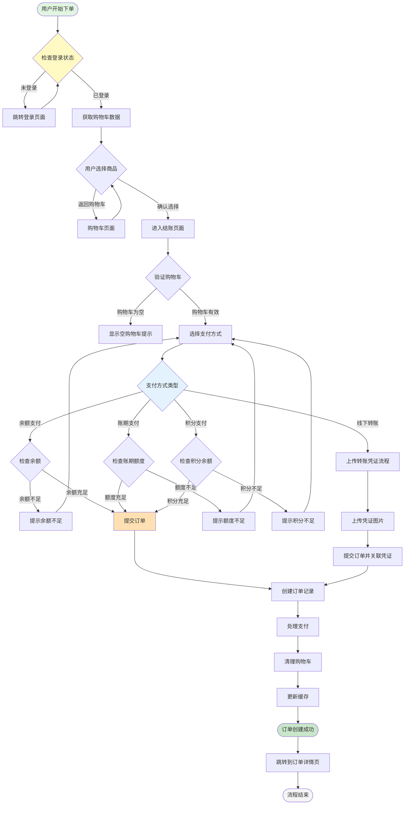
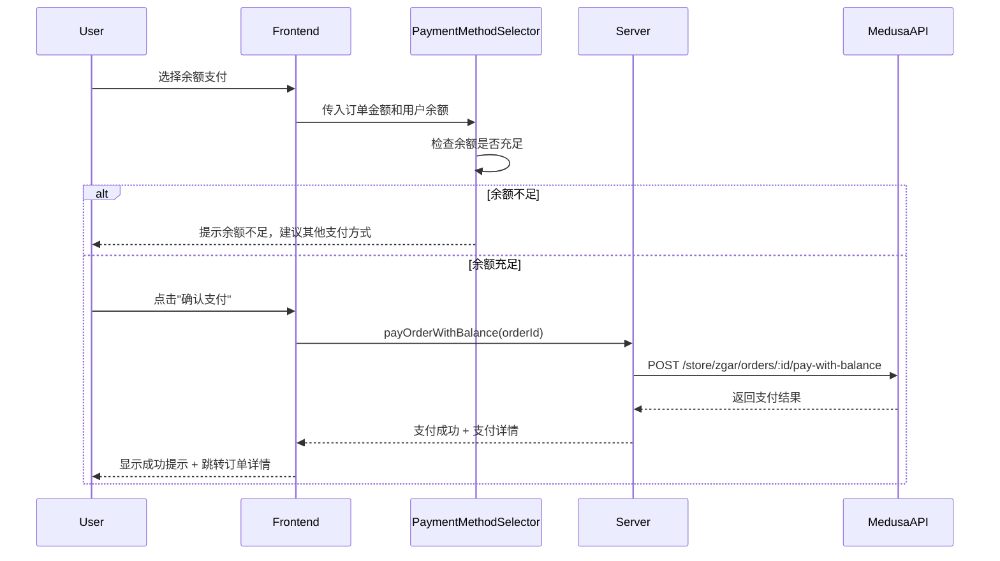
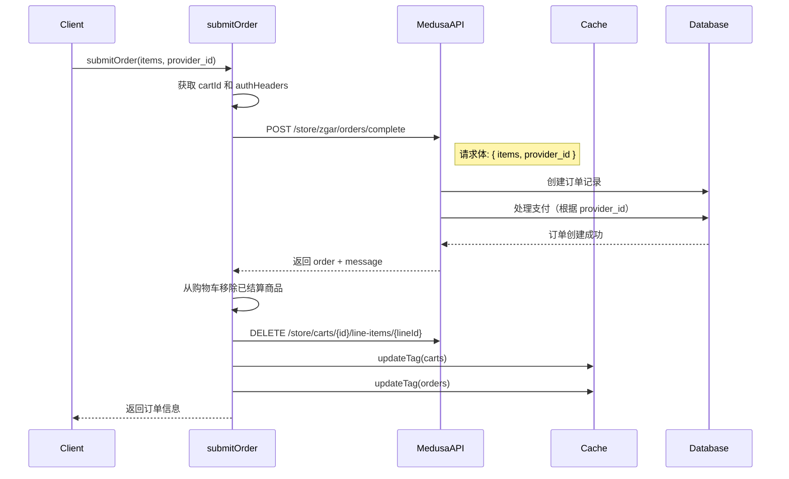
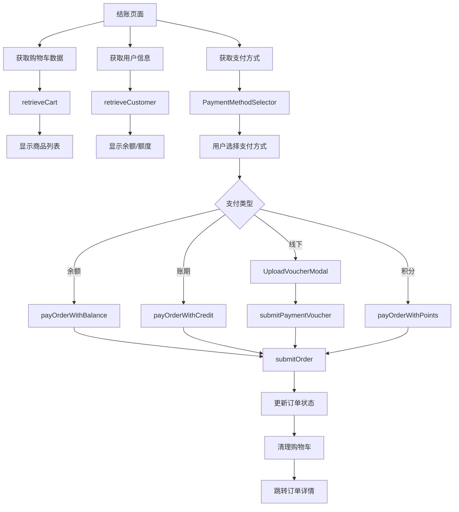

# 电商核心流程文档 - 下单流程

> **文档版本**: v1.0.0
> **最后更新**: 2026-03-05
> **维护者**: 开发团队

## 目录
- [概述](#概述)
- [完整下单流程](#完整下单流程)
- [购物车操作](#购物车操作)
- [支付方式](#支付方式)
- [订单提交](#订单提交)
- [结账页面](#结账页面)
- [数据流图](#数据流图)
- [错误处理](#错误处理)
- [常见问题](#常见问题)

---

## 概述

Zgar Portal 的下单流程基于 Medusajs 电商系统构建，支持多种支付方式（余额、账期、线下转账、积分）。整个流程分为**购物车管理**、**支付选择**、**订单提交**三个核心阶段。

### 核心特性
- 🛒 **多商品批量结算**：支持从购物车选择部分商品结算
- 💰 **多种支付方式**：余额、账期、线下转账、积分
- 🔒 **原子性操作**：订单创建与支付在同一事务中完成
- 📱 **响应式设计**：支持桌面端和移动端
- 🌐 **多语言支持**：中文简体、繁体、英文

### 技术栈
- **前端**: Next.js 16 + React 19
- **后端**: Medusajs SDK
- **数据获取**: RSC (Server Component 获取数据)
- **缓存策略**: Next.js Cache Tags
- **类型安全**: TypeScript

---

## 完整下单流程



---

## 购物车操作

购物车操作是下单流程的第一步，提供完整的 CRUD 功能。所有操作都通过 Server Actions 执行，确保安全性。

### 核心函数

#### 1. `getOrSetCart()`
**功能**: 获取或创建购物车

```typescript
// 位置: data/cart/server.ts
async function getOrSetCart(): Promise<StoreCart>
```

**流程**:
1. 从 Cookie 获取 `cart_id`
2. 如果存在，调用 `retrieveCart()` 获取购物车
3. 如果不存在或已过期，创建新购物车
4. 将新购物车 ID 存入 Cookie
5. 使用 `updateTag()` 立即更新缓存

**返回值**: `StoreCart` 对象

---

#### 2. `addToCart()`
**功能**: 添加商品到购物车

```typescript
// 位置: data/cart/server.ts
async function addToCart(cartLineItem: {
  variant_id: string;
  quantity: number;
  metadata?: Record<string, unknown>;
}): Promise<void>
```

**参数**:
- `variant_id`: 商品变体 ID（必填）
- `quantity`: 数量（必填）
- `metadata`: 元数据（可选）

**流程**:
1. 调用 `getOrSetCart()` 确保购物车存在
2. 调用 Medusa API `/store/carts/{id}/line-items`
3. 使用 `updateTag()` 更新缓存
4. React Suspense 自动重新获取数据

**错误处理**:
- 商品不存在 → 抛出错误
- 库存不足 → 抛出错误

---

#### 3. `updateLineItem()`
**功能**: 更新购物车商品数量

```typescript
// 位置: data/cart/server.ts
async function updateLineItem({
  lineId,
  quantity
}: {
  lineId: string;
  quantity: number;
}): Promise<void>
```

**参数**:
- `lineId`: 购物车项目 ID（必填）
- `quantity`: 新数量（必填）

**流程**:
1. 验证 `lineId` 和 `cartId` 存在
2. 调用 Medusa API `/store/carts/{cartId}/line-items/{lineId}`
3. 使用 `updateTag()` 更新缓存

**边界情况**:
- `quantity = 0` → 相当于删除商品
- `quantity < 0` → 抛出错误

---

#### 4. `deleteLineItem()`
**功能**: 删除购物车商品

```typescript
// 位置: data/cart/server.ts
async function deleteLineItem(lineId: string): Promise<void>
```

**参数**:
- `lineId`: 购物车项目 ID（必填）

**流程**:
1. 验证 `lineId` 和 `cartId` 存在
2. 调用 Medusa API `/store/carts/{cartId}/line-items/{lineId}` (DELETE)
3. 使用 `updateTag()` 更新缓存

---

#### 5. `batchDeleteCartItems()`
**功能**: 批量删除购物车商品

```typescript
// 位置: data/cart/server.ts
async function batchDeleteCartItems(
  cartId: string,
  itemIds: string[]
): Promise<void>
```

**参数**:
- `cartId`: 购物车 ID（必填）
- `itemIds`: 要删除的项目 ID 数组（必填）

**用途**: 购物车页面批量删除选中商品

---

#### 6. `batchAddCartItems()`
**功能**: 批量添加商品到购物车

```typescript
// 位置: data/cart/server.ts
async function batchAddCartItems(
  cartId: string,
  items: Array<{
    variant_id: string;
    quantity: number;
    metadata?: Record<string, unknown>;
  }>
): Promise<void>
```

**用途**: 产品选择弹窗批量添加商品

---

### 购物车数据结构

```typescript
interface StoreCart {
  id: string;
  email?: string;
  items: StoreCartLineItem[];
  region?: StoreRegion;
  total: number;
  currency_code: string;
  shipping_methods?: StoreCartShippingMethod[];
  payment_sessions?: StoreCartPaymentSession[];
}

interface StoreCartLineItem {
  id: string;
  product_id: string;
  variant_id: string;
  quantity: number;
  unit_price: number;
  total: number;
  title: string;
  thumbnail?: string;
  variant?: StoreProductVariant;
  metadata?: Record<string, unknown>;
}
```

---

## 支付方式

系统支持四种支付方式，每种方式有独特的处理流程和验证逻辑。

### 支付方式概览

| 支付方式 | Provider ID | 描述 | 验证逻辑 |
|---------|-------------|------|---------|
| **余额支付** | `pp_zgar_balance_payment_zgar` | 使用账户余额直接支付 | 检查 `zgar_customer.balance` |
| **账期支付** | `pp_zgar_credit_payment_zgar` | 使用信用额度后付款 | 检查 `zgar_customer.credit_limit` |
| **线下支付** | `pp_zgar_offline_payment_zgar` | 银行转账，需上传凭证 | 无预验证 |
| **积分支付** | `pp_zgar_points_payment_zgar` | 积分抵扣 | 检查 `zgar_customer.points` |

### 用户余额结构

```typescript
interface ZgarCustomer {
  balance: number;        // 可用余额
  points: number;         // 可用积分
  credit_limit: number;   // 账期额度
}
```

### 支付流程详解

#### 1. 余额支付流程



**关键代码** (`components/checkout/PaymentMethodSelector.tsx`):

```typescript
const handleBalancePayment = async () => {
  if (!hasEnoughBalance) {
    toast.error("余额不足，请选择其他支付方式");
    return;
  }

  setIsProcessing(true);

  try {
    const result = await payOrderWithBalance(orderId!);

    if (result.error) {
      toast.error(result.error || "余额支付失败");
      return;
    }

    toast.success(result.message || "余额支付成功！");

    // 显示支付详情（如果有账期欠款）
    if (result.credit_payment_amount > 0) {
      toast.info(
        `余额支付：${formatAmount(result.balance_payment_amount)}，账期欠款：${formatAmount(result.credit_payment_amount)}`
      );
    }

    onPaymentSuccess?.();
  } catch (error: any) {
    console.error("余额支付失败:", error);
    toast.error(error.message || "余额支付失败，请重试");
  } finally {
    setIsProcessing(false);
  }
};
```

---

#### 2. 账期支付流程

账期支付允许用户在额度范围内先消费后付款。

**流程**:
1. 检查用户账期额度 `credit_limit`
2. 额度不足 → 提示用户联系客服提升额度
3. 额度充足 → 创建订单，状态为 `pending_payment`
4. 后续在用户中心上传支付凭证或等待客服审核

---

#### 3. 线下支付流程

线下支付需要用户上传银行转账凭证。

**流程图**:


**关键组件**:
- `components/modals/UploadVoucherModal.tsx`: 上传凭证弹窗
- `data/orders/server.ts`: `uploadPaymentVoucherFiles()`, `submitPaymentVoucher()`

---

#### 4. 积分支付流程

积分支付允许用户使用积分抵扣订单金额。

**流程**:
1. 检查用户积分余额 `points`
2. 积分不足 → 提示用户积分不够
3. 积分充足 → 调用积分支付接口
4. 扣除积分，创建订单

---

## 订单提交

订单提交是下单流程的最后一步，负责创建订单记录并处理支付。

### 核心函数

#### `submitOrder()` - 统一下单接口

**功能**: 支持多种支付方式的统一下单接口

```typescript
// 位置: data/cart/server.ts
async function submitOrder(
  items: StoreAddCartLineItem[],
  provider_id?: string
): Promise<{
  order: StoreOrder;
  message?: string
}>
```

**参数**:
- `items`: 要结算的商品列表
- `provider_id`: 支付提供商 ID（可选）

**流程**:



**代码实现**:

```typescript
export async function submitOrder(
  items: HttpTypes.StoreAddCartLineItem[],
  provider_id?: string
): Promise<{ order: HttpTypes.StoreOrder; message?: string }> {
  const cartId = await getCartId();
  const locale = await getLocale();
  const headers = getMedusaHeaders(locale, await getAuthHeaders());

  try {
    // 调用新的统一下单接口
    const result = await medusaSDK.client.fetch<{
      order: HttpTypes.StoreOrder;
      message: string
    }>(
      "/store/zgar/orders/complete",
      {
        method: "POST",
        headers,
        body: {
          items,
          provider_id,  // 可选，不传则默认使用手动支付
        },
      }
    );

    // 从购物车中移除已结算的items
    if (cartId) {
      try {
        const cartResp = await medusaSDK.client.fetch<HttpTypes.StoreCartResponse>(
          `/store/carts/${cartId}`,
          { method: "GET", headers }
        );
        const cart = cartResp.cart;

        const lineItemsToRemove = cart.items?.filter((cartItem: any) => {
          return items.some(checkoutItem =>
            checkoutItem.variant_id === cartItem.variant_id
          );
        }) || [];

        for (const lineItem of lineItemsToRemove) {
          await medusaSDK.client.fetch(
            `/store/carts/${cartId}/line-items/${lineItem.id}`,
            { method: "DELETE", headers }
          );
        }
      } catch (error) {
        console.error("Error removing checked out items from cart:", error);
      }

      // 更新缓存
      const cartCacheTag = await getCacheTag("carts");
      updateTag(cartCacheTag);

      const orderCacheTag = await getCacheTag("orders");
      updateTag(orderCacheTag);
    }

    return result;
  } catch (error: any) {
    console.error("统一下单失败:", error);
    throw error;
  }
}
```

---

### 特殊支付函数

#### `completeZgarCartCheckoutWithBalance()` - 余额支付专用

**功能**: 一步式余额支付，原子操作

```typescript
// 位置: data/cart/server.ts
async function completeZgarCartCheckoutWithBalance(
  items: StoreAddCartLineItem[]
): Promise<CompleteCartWithBalanceResponse>
```

**特点**:
- 原子操作：订单创建和余额扣减在同一事务中
- 避免部分失败：要么全部成功，要么全部回滚
- 自动清理购物车

---

## 结账页面

### 路由结构

```
app/[locale]/(layout)/(other-pages)/checkout/page.jsx
```

### 页面组件

#### `Checkout.tsx` - 主结账组件

**功能**: 展示结账表单和订单摘要

**当前状态**: ⚠️ 该组件使用 Mock 数据，待集成真实购物车数据

**包含内容**:
1. **优惠券码输入**
2. **收货信息表单**（姓名、邮箱、电话、地址）
3. **支付方式选择**（银行转账、信用卡、货到付款、PayPal）
4. **配送方式选择**
5. **订单摘要**（商品列表、总价）

---

#### `PaymentMethodSelector.tsx` - 支付方式选择组件

**功能**: 动态渲染支付方式并处理支付逻辑

**Props**:

```typescript
interface PaymentMethodSelectorProps {
  paymentProviders: PaymentProvider[];  // 支付方式列表
  mode?: "selection" | "payment";       // 模式：选择 or 完整支付
  orderId?: string;                     // 订单ID
  orderAmount: number;                  // 订单金额
  customer?: StoreCustomer | null;      // 用户信息
  onPaymentMethodChange?: (providerId: string) => void;
  onPaymentSuccess?: () => void;
}
```

**关键特性**:
- 🎯 动态渲染后端返回的支付方式
- 💰 显示用户余额和额度
- 🔒 验证支付条件（余额、额度等）
- 📱 响应式设计，支持移动端

**UI 交互**:
1. 默认选择余额支付
2. 折叠式设计，展开显示详细信息
3. 余额不足时提示其他支付方式
4. 加载状态处理

---

### 数据流图



---

## 错误处理

### 常见错误类型

| 错误类型 | HTTP 状态码 | 处理方式 |
|---------|------------|---------|
| 购物车不存在 | 404 | 自动创建新购物车 |
| 未登录 | 401 | 跳转登录页面 |
| 库存不足 | 400 | 提示用户减少数量 |
| 余额不足 | 400 | 提示选择其他支付方式 |
| 支付失败 | 500 | 显示错误信息，保留购物车 |

### 错误处理示例

```typescript
try {
  const result = await submitOrder(items, provider_id);
  toast.success("订单创建成功！");
  router.push(`/account/orders/${result.order.id}`);
} catch (error: any) {
  console.error("下单失败:", error);

  if (error.response?.status === 401) {
    toast.error("请先登录");
    router.push("/login");
  } else if (error.message?.includes("insufficient")) {
    toast.error("余额不足，请选择其他支付方式");
  } else {
    toast.error(error.message || "下单失败，请重试");
  }
}
```

---

## 常见问题

### Q1: 购物车数据丢失怎么办？

**A**: 系统会自动创建新购物车。如果用户已登录，购物车数据会关联到账户，不会丢失。

### Q2: 支付时订单创建成功但扣款失败？

**A**:
- 余额支付：使用原子操作，不会出现此问题
- 线下支付：订单状态为 `pending_payment`，等待客服审核
- 其他支付：请联系客服处理

### Q3: 如何处理支付超时？

**A**: 订单创建后会设置支付超时时间（通常 30 分钟），超时后订单自动取消。

### Q4: 购物车缓存更新不及时？

**A**: 所有购物车操作都使用 `updateTag()` 更新缓存，React Suspense 会自动重新获取数据。如有延迟，可手动刷新页面。

### Q5: 如何支持新的支付方式？

**A**:
1. 在后端添加新的 Payment Provider
2. 更新 `PaymentProvider` 类型定义
3. `PaymentMethodSelector` 会自动渲染新支付方式

---

## 附录

### 相关文件清单

#### 数据层
- `data/cart/server.ts` - 购物车操作（850 行）
- `data/orders/server.ts` - 订单操作（478 行）
- `data/payments.ts` - 支付相关操作

#### 组件层
- `components/checkout/PaymentMethodSelector.tsx` - 支付方式选择（444 行）
- `components/modals/UploadVoucherModal.tsx` - 上传凭证弹窗
- `components/other-pages/Checkout.tsx` - 结账页面（502 行）

#### 页面层
- `app/[locale]/(layout)/(other-pages)/checkout/page.jsx` - 结账页面路由

#### 工具层
- `utils/cookies.ts` - Cookie 管理（cart_id）
- `utils/medusa-server.ts` - Medusajs 服务端工具
- `utils/medusa-error.ts` - 错误处理工具

---

### API 端点

| 端点 | 方法 | 描述 |
|-----|------|------|
| `/store/carts` | POST | 创建购物车 |
| `/store/carts/{id}` | GET | 获取购物车 |
| `/store/carts/{id}/line-items` | POST | 添加商品 |
| `/store/carts/{id}/line-items/{lineId}` | POST | 更新数量 |
| `/store/carts/{id}/line-items/{lineId}` | DELETE | 删除商品 |
| `/store/zgar/cart/complete` | POST | ZGAR 结算（旧版） |
| `/store/zgar/orders/complete` | POST | 统一下单（新版） |
| `/store/zgar/cart/complete-with-balance` | POST | 余额支付专用 |
| `/store/zgar/orders/{id}/pay-with-balance` | POST | 订单余额支付 |
| `/store/zgar/orders/{id}/transition` | POST | 订单流转（上传凭证等） |
| `/store/zgar/files` | POST | 上传文件（凭证、附件） |

---

## 更新日志

### v1.0.0 (2026-03-05)
- ✅ 初始版本发布
- ✅ 完整的下单流程文档
- ✅ Mermaid 流程图
- ✅ 购物车操作函数说明
- ✅ 四种支付方式详解
- ✅ 统一下单接口文档

---

## 维护说明

### 文档更新责任
- **架构变更**: 架构师负责更新文档
- **API 变更**: 后端开发负责同步更新
- **功能迭代**: 前端开发负责补充说明

### 审查周期
- **月度审查**: 每月检查文档与代码的一致性
- **版本发布**: 每次大版本发布后更新文档

---

**文档结束** 📄
