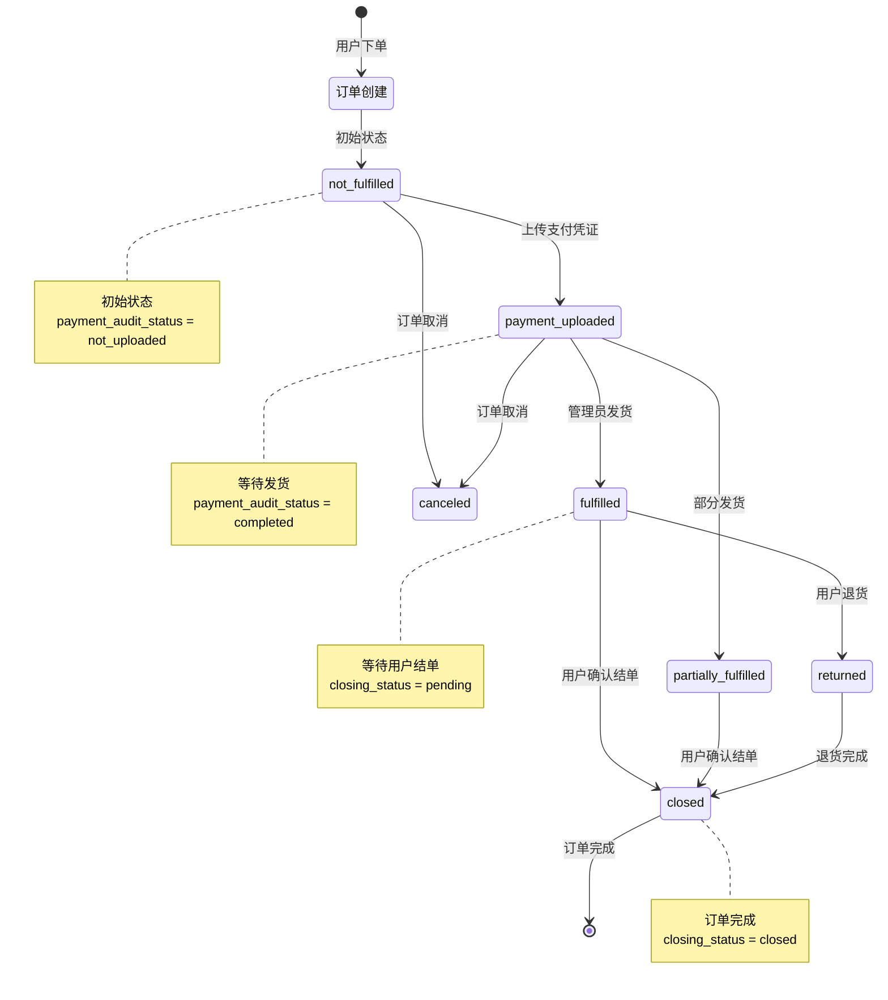

# 订单状态流转文档

## 概述

本文档描述 Zgar Portal 电商系统的订单状态流转机制，包括三种独立的状态维度、状态转换规则以及相关的 API 接口。

## 状态枚举定义

### 1. 配送状态 (fulfillment_status)

描述订单的物流配送状态。

```typescript
type FulfillmentStatus =
  | 'not_fulfilled'       // 未发货 - 初始状态
  | 'fulfilled'           // 已发货/已完成
  | 'partially_fulfilled' // 部分发货
  | 'returned'            // 已退货
  | 'canceled';           // 已取消
```

### 2. 支付凭证状态 (payment_audit_status)

描述用户是否上传支付凭证。

```typescript
type PaymentAuditStatus =
  | 'not_uploaded'        // 未上传支付凭证
  | 'completed';          // 已上传支付凭证
```

### 3. 结单状态 (closing_status)

描述订单的最终完成状态。

```typescript
type ClosingStatus =
  | 'pending'             // 待结单
  | 'closed';             // 已结单（订单完成）
```

## 状态流转流程图



## 状态流转 API

### 接口定义

```typescript
POST /store/zgar/orders/:id/transition
```

### 支持的操作 (action)

| 操作值 | 描述 | 触发的状态变化 |
|--------|------|----------------|
| `upload-payment-voucher` | 上传支付凭证 | `payment_audit_status: not_uploaded → completed` |
| `update-packing-requirement` | 更新打包要求 | 不改变状态，仅更新订单备注 |
| `submit-closing` | 提交结单信息 | `closing_status: pending → closed` |
| `update-shipping-address` | 更新收货地址 | 不改变状态，仅更新地址信息 |

### 请求示例

#### 上传支付凭证

```typescript
const response = await fetch(`/store/zgar/orders/${orderId}/transition`, {
  method: 'POST',
  headers: {
    'Content-Type': 'application/json',
  },
  body: JSON.stringify({
    action: 'upload-payment-voucher',
    voucher_url: 'https://example.com/voucher.jpg',
    voucher_note: '银行转账凭证',
  }),
});
```

#### 提交结单信息

```typescript
const response = await fetch(`/store/zgar/orders/${orderId}/transition`, {
  method: 'POST',
  headers: {
    'Content-Type': 'application/json',
  },
  body: JSON.stringify({
    action: 'submit-closing',
    closing_note: '商品已收到，确认结单',
    rating: 5,
  }),
});
```

## 状态展示配色方案

### 配送状态颜色

| 状态 | 显示名称 | 颜色 | CSS Class | 说明 |
|------|----------|------|-----------|------|
| `not_fulfilled` | 待发货 | 粉色 | `bg-[#FF71CE]` | 等待发货 |
| `fulfilled` | 已发货 | 蓝色 | `bg-[#0047c7]` | 已完成发货 |
| `partially_fulfilled` | 部分发货 | 蓝色 | `bg-[#0047c7]` opacity-80 | 部分商品已发货 |
| `returned` | 已退货 | 黄色 | `bg-[#FFFB00]` | 退货处理中 |
| `canceled` | 已取消 | 灰色 | `bg-gray-400` | 订单已取消 |

### 支付凭证状态颜色

| 状态 | 显示名称 | 颜色 | CSS Class | 说明 |
|------|----------|------|-----------|------|
| `not_uploaded` | 待上传 | 粉色 | `bg-[#FF71CE]` | 需要上传支付凭证 |
| `completed` | 已上传 | 蓝色 | `bg-[#0047c7]` | 支付凭证已上传 |

### 结单状态颜色

| 状态 | 显示名称 | 颜色 | CSS Class | 说明 |
|------|----------|------|-----------|------|
| `pending` | 待结单 | 粉色 | `bg-[#FF71CE]` | 等待用户确认收货 |
| `closed` | 已完成 | 蓝色 | `bg-[#0047c7]` | 订单已完成 |

## 状态组合示例

### 典型订单状态组合

| 场景 | fulfillment_status | payment_audit_status | closing_status | 显示状态 |
|------|-------------------|----------------------|----------------|----------|
| 新建订单 | `not_fulfilled` | `not_uploaded` | `pending` | 待上传凭证 |
| 已上传凭证 | `not_fulfilled` | `completed` | `pending` | 待发货 |
| 已发货 | `fulfilled` | `completed` | `pending` | 待结单 |
| 订单完成 | `fulfilled` | `completed` | `closed` | 已完成 |
| 已取消 | `canceled` | - | - | 已取消 |

## 相关文件

- **API 路由**: `app/[locale]/(store)/api/orders/[id]/transition/route.ts`
- **订单详情页**: `app/[locale]/(store)/orders/[id]/page.tsx`
- **订单组件**: `components/orders/OrderStatusBadge.tsx`
- **状态映射**: `lib/order-status.ts`

## 变更记录

- 2026-03-05: 初始版本，定义三种状态枚举和流转规则
