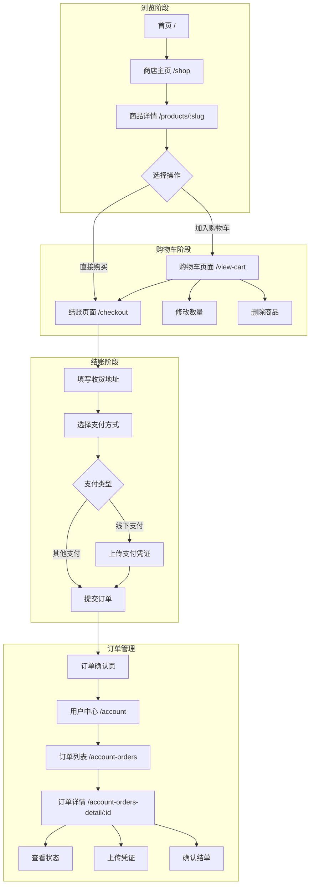
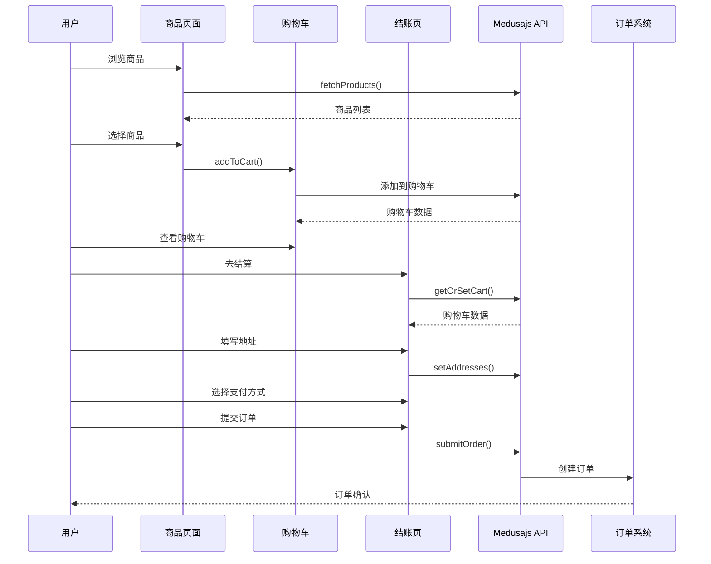
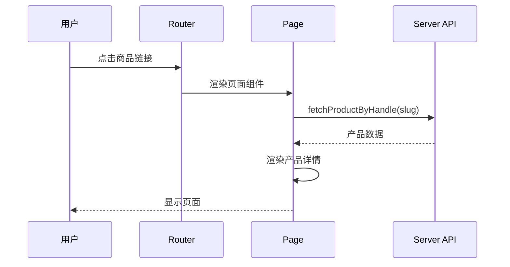
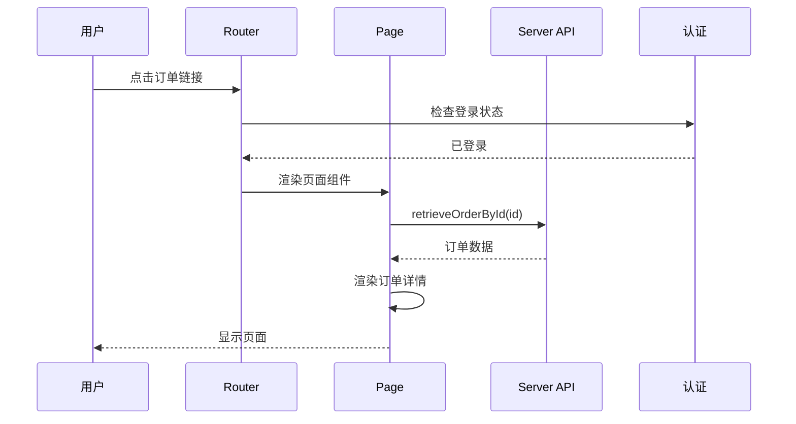

# 电商页面关系与流程

## 概述

本文档描述 Zgar Portal 电商系统的页面关系、路由映射和用户购物路径流程。

---

## 用户购物路径图



---

## 完整下单流程图



---

## 文件与路由映射表

### 商店相关路由

| 路由 | 文件路径 | 功能 | 页面类型 |
|------|---------|------|---------|
| `/` | `app/[locale]/(layout)/page.tsx` | 首页 | 静态 |
| `/shop` | `app/[locale]/(layout)/(store)/shop/page.tsx` | 商品列表 | 静态 |
| `/products/:slug` | `app/[locale]/(layout)/(product-detail)/product-1/[id]/page.jsx` | 商品详情 | 动态 |
| `/products/:slug` | `app/[locale]/(layout)/(product-detail)/product-2/[id]/page.jsx` | 商品详情变体2 | 动态 |

### 购物车与结账

| 路由 | 文件路径 | 功能 | 页面类型 |
|------|---------|------|---------|
| `/view-cart` | `app/[locale]/(layout)/(other-pages)/view-cart/page.tsx` | 购物车页面 | 静态 |
| `/checkout` | `app/[locale]/(layout)/(other-pages)/checkout/page.jsx` | 结账页面 | 静态 |

### 用户中心

| 路由 | 文件路径 | 功能 | 页面类型 |
|------|---------|------|---------|
| `/account` | `app/[locale]/(layout)/(dashboard)/page.tsx` | 用户中心首页 | 静态 |
| `/account-details` | `app/[locale]/(layout)/(dashboard)/account-details/page.tsx` | 个人信息 | 静态 |
| `/account-orders` | `app/[locale]/(layout)/(dashboard)/account-orders/page.tsx` | 订单列表 | 静态 |
| `/account-orders-detail/:id` | `app/[locale]/(layout)/(dashboard)/account-orders-detail/[id]/page.tsx` | 订单详情 | 动态 |
| `/account-address` | `app/[locale]/(layout)/(dashboard)/account-address/page.tsx` | 地址管理 | 静态 |
| `/account-wishlist` | `app/[locale]/(layout)/(dashboard)/account-wishlist/page.tsx` | 收藏夹 | 静态 |

### 其他页面

| 路由 | 文件路径 | 功能 | 页面类型 |
|------|---------|------|---------|
| `/about` | `app/[locale]/(layout)/(other-pages)/about/page.tsx` | 关于我们 | 静态 |
| `/contact` | `app/[locale]/(layout)/(other-pages)/contact/page.tsx` | 联系我们 | 静态 |
| `/faq` | `app/[locale]/(layout)/(other-pages)/faq/page.tsx` | 常见问题 | 静态 |
| `/verify` | `app/[locale]/(layout)/(verify)/page.tsx` | 防伪验证 | 静态 |
| `/blogs` | `app/[locale]/(layout)/(blogs)/page.tsx` | 博客列表 | 静态 |

---

## 页面跳转关系

### 从商品详情页

```typescript
// 加入购物车后跳转
router.push('/view-cart')

// 直接购买
router.push('/checkout')

// 返回商店
router.push('/shop')
```

### 从购物车页

```typescript
// 去结算
router.push('/checkout')

// 继续购物
router.push('/shop')
```

### 从结账页

```typescript
// 订单提交成功
router.push(`/account-orders-detail/${orderId}`)

// 返回购物车
router.push('/view-cart')
```

### 从订单列表

```typescript
// 查看订单详情
router.push(`/account-orders-detail/${orderId}`)
```

---

## 组件与页面关系

### 商品列表页面组件树

```
ShopPage
├── ShopBanner (横幅)
├── Categories (分类)
├── ProductFilters (筛选器)
│   ├── PriceFilter
│   ├── BrandFilter
│   └── CategoryFilter
├── ProductGrid (产品网格)
│   └── ProductCard[] (产品卡片)
├── Pagination (分页)
└── Sorting (排序)
```

### 购物车页面组件树

```
ViewCartPage
├── CartItemList (商品列表)
│   └── CartItem[] (单个商品)
│       ├── ProductImage
│       ├── QuantitySelector
│       └── DeleteButton
├── CartSummary (价格汇总)
└── CheckoutButton (结账按钮)
```

### 订单详情页面组件树

```
OrderDetailPage
├── OrderHeader (订单头部)
│   ├── OrderId
│   ├── OrderStatus
│   └── OrderDate
├── OrderItems (订单商品)
│   └── OrderItem[]
├── OrderSummary (订单汇总)
│   ├── Subtotal
│   ├── Shipping
│   └── Total
├── ShippingAddress (收货地址)
├── PaymentInfo (支付信息)
└── OrderActionGuide (操作指引)
```

---

## 路由组说明

### (layout) 路由组

包含所有使用主布局的页面，共享 `layout.tsx` 布局文件。

```
app/[locale]/(layout)/
├── layout.tsx          # 主布局
├── page.tsx            # 首页
├── (store)/            # 商店模块
├── (dashboard)/        # 用户仪表盘
├── (product-detail)/   # 产品详情
├── (blogs)/            # 博客模块
├── (other-pages)/      # 其他页面
├── (intro)/            # 介绍页面
├── (member)/           # 会员模块
└── (verify)/           # 验证模块
```

### 动态路由参数

| 路由模式 | 参数名 | 示例 | 用途 |
|---------|--------|------|------|
| `[id]` | id | `product-1/123` | 产品ID |
| `[slug]` | slug | `products/my-product` | 产品别名 |
| `[locale]` | locale | `zh-CN/shop` | 语言标识 |

---

## 页面加载流程

### 商品详情页加载



### 订单详情页加载



---

## 相关文档

- [商品列表流程](./product-list.md)
- [下单流程](./order-flow.md)
- [订单详情](./order-detail.md)
- [订单状态流转](./order-status.md)
- [路由表](../routes.md)

---

## 变更记录

| 日期 | 版本 | 变更说明 |
|------|------|---------|
| 2026-03-05 | 1.0.0 | 初始版本 |
